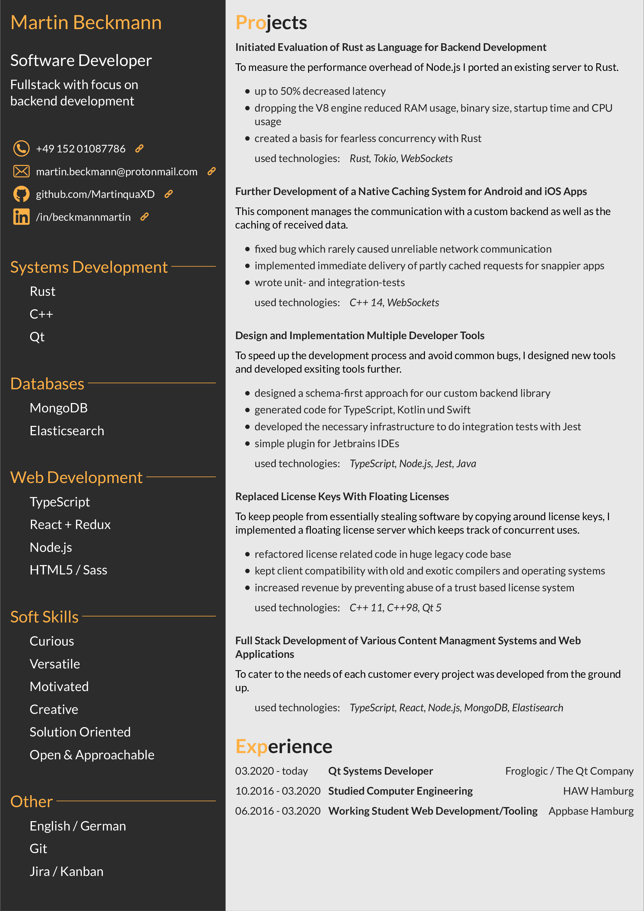
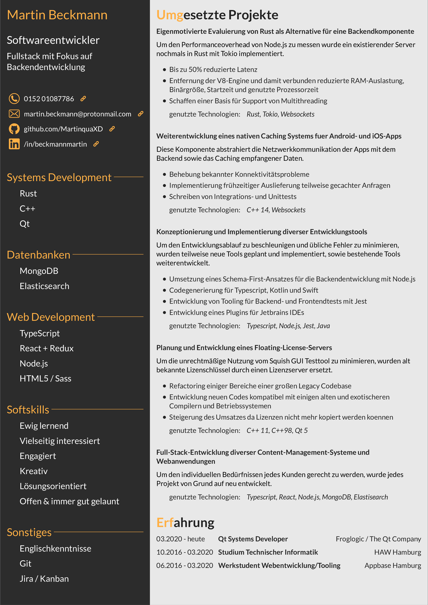

# Motivation
This repository represents my CV including education and working experience. The CV is basically a styled website which 
gets exported as a pdf.  

To build it yourself just checkout the project, install required packages with ```npm install``` and compile the style with ```npm run compile-sass```.

# CV




